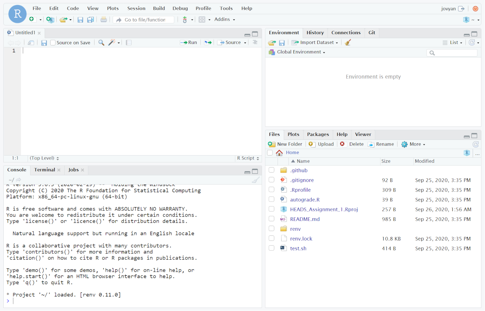

<!-- README.md is generated from README.Rmd. Please edit that file -->

```{r setup, include = FALSE}
knitr::opts_chunk$set(
#  collapse = TRUE,
#  comment = "#>",
  fig.path = ".assets/figures/README-",
  echo = TRUE,
  message = FALSE,
  warning = FALSE,
  tidy.opts = list(width.cutoff = 60),
  tidy = TRUE
)

```


<!-- start badges -->

[](https://patient-cherry-7bc4.franzbischoff.workers.dev)

<!-- end badges -->

In this module you will be introduced to Rstudio and Github.
This module will cover:

-   What is an IDE and why we use it;
-   How to use a versioning system and its importance;
-   Write a simple example of R code;
-   Submit the answer for evaluation.

## Lessons:

### Module 1.1: What is an IDE

[:tv: Module 1.1 Video](https://youtu.be/d1PVR37WR_4 "📺 Module 1.1 Video")

Before talking about the IDE, we have to bear in mind that to build a program, we need only two things:

-   A text file with the code (you can use the notepad for example)
-   A compiler or an [interpreter](https://en.wikipedia.org/wiki/Scripting_language) (the former typically builds a .exe file, the later interprets the code in real-time)

So why we need an IDE?
An [IDE](https://en.wikipedia.org/wiki/Integrated_development_environment) (Integrated development environment) is a software that has as objective helping the developer to code faster and without errors.
Usually, an IDE has integrated the following features:

-   A **Text Editor**: with code completion (helps you to write faster); syntax highlighting (allows you to see clearly your code) and sometimes also auto-formatting (to help you to add spaces or new-lines where they should be); real-time diagnostics (that shows the errors in your code).
-   A **File Explorer** or even better, a **Project Explorer**: that shows the project folder and files that are included in your project.
-   **Help Documents**: so you can learn or consult the information about the language you are using, libraries, functions, etc.
-   **Versioning Control**: allows you to use a versioning control system like [GIT](https://en.wikipedia.org/wiki/Git#Adoption). We will talk more about this later.

In our case, we will use the RStudio IDE, that also has these important features:

-   A **Console**: that is a place where you can write commands, one by one (you usually will prefer to write the commands in the Editor and save in a file), and is where you can also see the output, messages and errors of your program.
-   An **Environment** tab: where you can inspect all variables and dataset you create, or it is loaded on memory.
-   A **History** tab: that records all your previous commands
-   A **Plot** and **Viewer** tabs: where you see graphics and other kinds of visual content.

Here is a screenshot of a clean install of RStudio:



------------------------------------------------------------------------

### Module 1.2: How to use a versioning system

Now we will meet the [GIT](https://en.wikipedia.org/wiki/Git "GIT"), the most [widely used](https://ianskerrett.wordpress.com/2014/06/23/eclipse-community-survey-2014-results/) source-code management tool.

You may not be aware, but you probably already use your own version control when you write a document and save a "draft," "second draft," "final draft."

A versioning system is just that.
It maintains multiple versions of files.

When you start coding, you will have several versions of your code.
You may accidentally delete something or write something that makes your program stop working.
That's where the versioning system comes in handy.

GIT is a distributed versioning system.
That means everyone who collaborates with you has a full copy of the repository, which adds another safety layer.
A non-distributed versioning system keeps the full copy only in a server, that may break and lose all your work.

You might wonder if I already naturally save copies of my work, why do I need GIT?

GIT allows you to manage these changes while writing your program and revert some changes to an older version if you need to.
You can inspect the changes you made between versions, work collaboratively, and know which lines were changed by other users.

So let's start with the most straightforward workflow you need to start using GIT in our classes.

#### Cloning a repository

Cloning a repository means that you are making a full copy from the remote repository while keeping a link with it for future updates.

You have two options to clone the assignment repository:

1.  Using RStudio installed on your machine

    1.  Click on the **⤓ Code** button that is in the top-right position of this page.
        Select the HTTPS tab, and copy the URL presented there.

    2.  In RStudio, select **File ➝ New Project...**

    3.  On **Create Project** dialogue, select **Version Control**, and then **GIT**.

    4.  Paste the URL on **Repository URL** field and choose where the files will be stored, then click on **Create Project**.

2.  Using RStudio on Binder

    1.  Just click on [](https://patient-cherry-7bc4.franzbischoff.workers.dev) that is located on top of this document and a remote session will be opened.
        The first times it may take a while because **Binder** needs to set up the environment for you.
        [More...](https://discourse.jupyter.org/t/how-to-reduce-mybinder-org-repository-startup-time/4956 "More about binder")

        > :warning:**ATTENTION:** bookmark the URL of your session, and every time you finish coding, **send your changes back to GIT** because this session may be suspended after a certain period of inactivity.

#### Sending changes back to GIT

Before diving in this subject, let me explain the file states.

The files in your project can be in the following states:

1.  Working Directory: here are the files that are unchanged, modified, or not yet added to the project (new files).
2.  Staging Area: here are the files you tell GIT that they are ready to be committed (modified files or adding new files, or even deleted files)
3.  Local Repository: here are the committed changes, or we can call it as the latest snapshot of your project.

So, when you first open your project, there is nothing to do.
If you click on the tab "GIT" on RStudio, nothing will be listed there.

When you modify, delete or add a new file to the *Working Directory*, the GIT tab will start to show these changes.
You can click with the right mouse button on each item to see what you can do about, like *ignore* this file (the file will not be committed, this is useful for authentication files that stores information you don't want to share but is needed for development), or *revert* the changes you made.

Now let's start with the interesting part, submit the changes to the remote repository.

1.  Click on the "GIT" tab to access the Versioning System.

2.  Select all items you want to commit, and click in one of the checkbox from the column "Staged".
    You can unstage any item if you made a mistake.

    > :warning:**ATTENTION:** at this point you may edit any of these files, and it will appear as "Staged-modified" (with a double :m: on status column. **You have to stage this file again**.

3.  Click on the :ballot_box_with_check: Commit button.
    A dialogue will be opened.

4.  Write a message on the "Commit message" box.
    All commits must have a message.
    It is important for everyone to know what changes you did in this snapshot.

5.  Click on the "Commit" button.

    > :spiral_notepad:**NOTE:** now your changes have been committed to your **Local** repository, you can still make changes and new commits before sending all to the **Remote** repository.

6.  Click on the button "Push".
    Now the system will attempt to connect with the remote repository.
    Fill the username and password with your credentials from Github, and then complete the Push.

It's done.
Your code is now saved in your **Remote** repository and can be "Pulled" by collaborators or yourself to update any **Local** repository.

### Module 1.3: Write a simple R code

Your first task is straightforward:

1.  Create, in the project folder, a new file named "assignment.R" (with upper-case .R)
2.  Write any code that prints in the console the following text: "Hello, World!"
3.  Save the file

### Module 1.4: Submit the answer

Now that you have all done, use your knowledge from **Module 1.2** and submit the answer to your Remote repository.
Your answer will be automatically checked.
